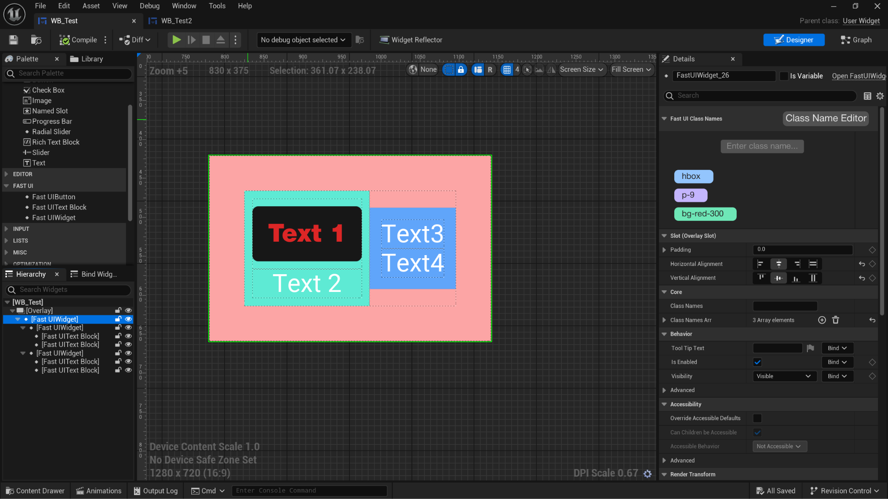
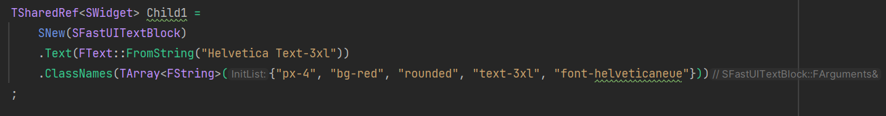

# Fast UI
This is an experimental Unreal Engine 5 plugin to allow [TailwindCSS](https://tailwindcss.com)-like styling with UMG and Slate UI. The class names can dynamically control layout, spacing, typography, coloring, and even simple animations.

## Getting Started (UMG)
To use class names in UMG, you may add FastUI widgets in the Widget Designer - where you can input class names in the Class Name Editor within the Details panel.

## Getting Started (Slate/C++)
You can also create FastUI Slate widgets where you can input the class names as an TArray\<FString>.

## Supported Class Names

### Container
| Class Name    | Effect |
| -------- | ------- |
| `vbox`  | Widget acts as an SVerticalBox    |
| `hbox` | Widget acts as an SHorizontalBox     |
| `overlay`    | Widget acts as an SOverlay    |

### Layout Slot
| Class Name    | Effect |
| -------- | ------- |
| `h-center`  | HAlign_Center |
| `h-left` | HAlign_Left |
| `h-right`    | HAlign_Right |
| `h-fill`    | HAlign_Fill |
| `v-center`  | VAlign_Center |
| `v-left` | VAlign_Left |
| `v-right`    | VAlign_Right |
| `v-fill`    | VAlign_Fill |

### Spacing 
In the following, x and y are optional which limit the effect to the horizontal or vertical direction, respectively. The n is necessary controlling the scale of the effect.
| Class Name    | Effect |
| -------- | ------- |
| `m<x\|y>-<n>`  | Add a margin SBorder around the widget, excluding its background    |
| `p<x\|y>-<n>` | Add a padding SBorder around the widget, including its background    |

### Typography

| Class Name        | Effect                                                   |
|-------------------|----------------------------------------------------------|
| `text-xs`         | Sets a small font size, equivalent to 10pt               |
| `text-sm`         | Sets a slightly larger font size, equivalent to 12pt     |
| `text-base`       | Sets the base font size, equivalent to 14pt              |
| `text-lg`         | Sets a large font size, equivalent to 18pt               |
| `text-xl`         | Sets an extra-large font size, equivalent to 24pt        |
| `font-thin`       | Applies `EFontWeight::Thin` to the text                  |
| `font-extralight` | Applies `EFontWeight::ExtraLight` to the text            |
| `font-light`      | Applies `EFontWeight::Light` to the text                 |
| `font-normal`     | Applies `EFontWeight::Normal` to the text                |
| `font-medium`     | Applies `EFontWeight::Medium` to the text                |
| `font-semibold`   | Applies `EFontWeight::Semibold` to the text              |
| `font-bold`       | Applies `EFontWeight::Bold` to the text                  |
| `font-extrabold`  | Applies `EFontWeight::ExtraBold` to the text             |
| `font-black`      | Applies `EFontWeight::Black` to the text                 |
| `italic`          | Sets the text to italic |
| `text-left`          | Justify text left |
| `text-center`          | Justify text center |
| `text-right`          | Justify text right|

### Animations
Animations affect itself and all of its children.
| Class Name    | Effect |
| -------- | ------- |
| `animate-spin`  | Spin the entire widget |
| `animate-ping` | Scale down to up, decreasing opacity each iteration |
| `animate-pulse` | Increase/decrease opacity in a loop |

### Colors
By default, the color palette is loaded in using `Content/Slate/Colors/StandardColors.json`, which follows the TailwindCSS syntax. Each color is attached to the following class names: `bg-<color>`, `text-<color>`, `outline-<color>`. So for example to make the background a dark pink you may use `bg-pink-800`.